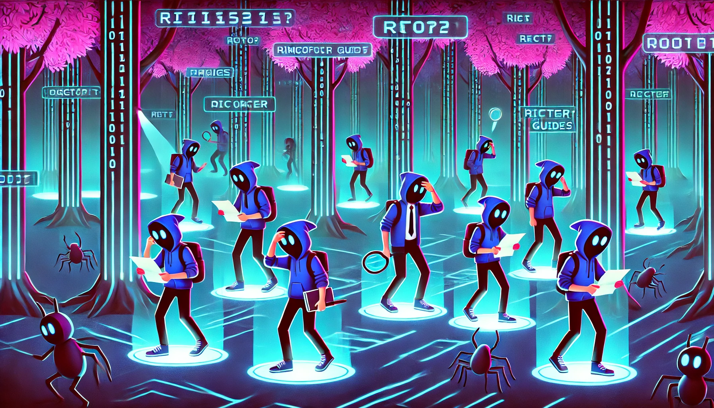

<h2>Navigation</h2>

  <table style="width:100%;">
    <tr>
      <!-- Navigation menu on the left -->
      <td style="width:60%;">
        <ul>
          <li><a href="/notes/program-links">Bug Bounty Programs</a></li>
          <li><a href="/notes/recon-methodology">Recon Methodology</a></li>
          <li><a href="/notes/app-checklist">Application Checklist</a></li>
          <li><a href="/notes/vuln-testing">Vulnerability Testing</a></li>
          <li><a href="/notes/auto-scripts">Automation Scripts</a></li>
        </ul>
      </td>
      <!-- Image on the right -->
      <td style="width:40%;">
  

    
  

</td>
    </tr>
  </table>

---

## References

[OWASP Top 10](https://owasp.org/www-project-top-ten/)
 
[HackTricks](https://book.hacktricks.xyz/)
 
[Portswigger](https://portswigger.net/research)
 
[R-s0n GitHub](https://github.com/R-s0n)
 
[Back to top](#navigation)

---
