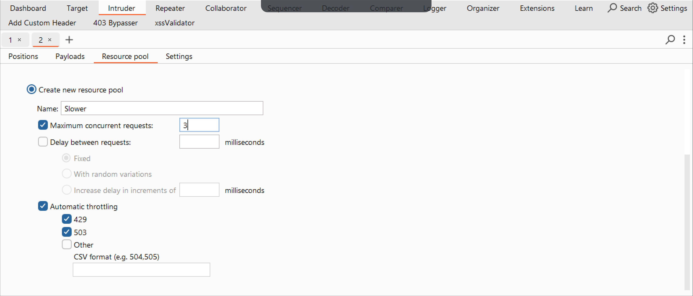

### Background 
Earlier this year, my team and I were testing a publicly accessible web application. Although I won't specify the site or CMS, the experience highlighted a vital aspect of security testing.

Over the two weeks, we meticulously followed the OWASP testing guide, extensively enumerating every feature of the application. Despite our thorough efforts, we initially found no vulnerabilities. It wasn't until the end of our assignment that I decided to delve deeper by fuzzing directories several levels deep, driven by a determination to find anything that might have been overlooked.

### Let There be Fuzz
There are several tools we can use for fuzzing in scenarios like this, but I prefer to stay inside Burpsuite for most of my testing needs. We can simply send our request to Intruder and highlight what we want to fuzz. It's worth mentioning that you need Burpsuite Pro to avoid rate limiting. Once in Intruder, typically, I select the parameters I want to fuzz, highlight them, and click "Add." Then, I choose my wordlist, depending on what I am targeting. SecList usually has what I need. It's important to try several different wordlists when fuzzing. One that I have found particularly useful for APIs and even some directories is the api-res wordlist under SecLists>Discovery>Web-Content>api>api-endpoints-res.txt. 

Finally, I'll configure the speed at which we want to fuzz. Although it's unlikely, we don't want to overwhelm the server in any way, so I usually reduce the number of concurrent requests to two or three. Next, we start fuzzing. Another crucial aspect of fuzzing is filtering through our results. Fortunately, Burpsuite makes this easy. We can search for specific words, depending on the type of testing we're conducting, or we can sort by response codes, sizes, etc.
<p align="center">
  
</p>
<br>
So, utilizing various wordlists, I began probing deeper into the application’s directory structure. Interestingly, I discovered that accessing /01 redirected to a group's main page, while /02 led to a secondary page, if it existed. Encouraged by this pattern, I continued with /03, /04, and so on. This approach started revealing new, unindexed pages, some of which were admin pages that had not been identified in earlier phases of testing.

To exploit this finding systematically, I created a wordlist ranging from 1 to 50 and resumed fuzzing across all known directory groups. This unearthed several intriguing pages, but one really stood out: it was used by admins to send notifications to various user groups within the application, including other Admins, regular users, and other specific groups.

To assess the security of this notification feature, I executed a test by sending a notification to our pentester group that included an XSS payload similar to the one below:
```bash
'"><img src=1 onerror=console.log(document.domain)
```

Unexpectedly, when we received the notification, the page included it without any sort of validation or sanitizarion. The JavaScript executed, confirming stored XSS. This experience underscores the indispensable value of fuzzing in penetration testing and bug bounty hunting. As bug bounty hunters, we don't have all the time that threat actors do to enumerate our target. And so, we must prioritze our activities. If we don't fuzz, we truly don't know what vulnerabilities lie hidden, waiting to be exploited. This single finding alone illustrates why thorough testing, beyond standard enumeration, is crucial for uncovering deeper security flaws. Try harder!
