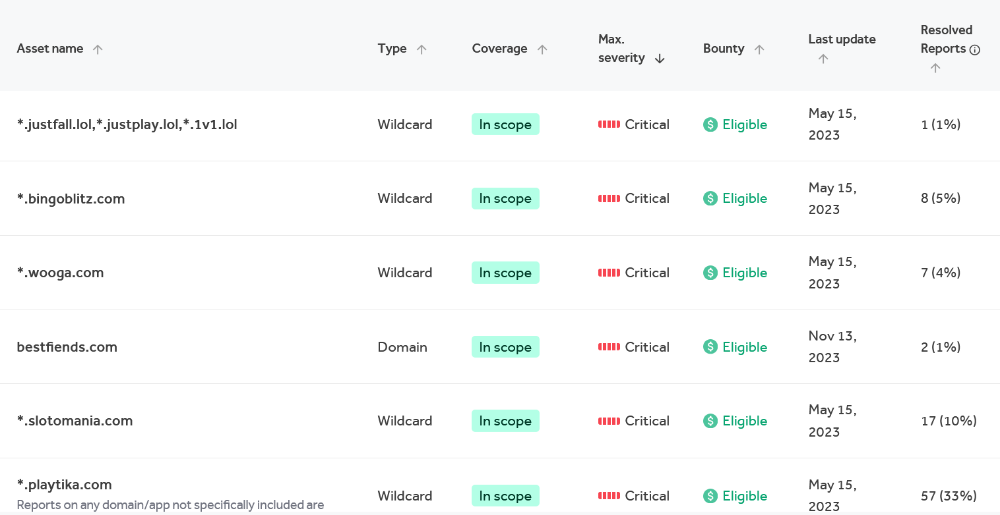

### Echo $Hacker | ./initiate_bugbounty 

Hello to the two or three people out there who read these posts. I’m pretty sure I write these more for myself than anyone else. It’s a great way to track my progress and get some writing in—win-win! Anyway, let’s get down to business. 

As a recent entrant to the bug bounty scene with moderate success, I hope to share a short guide to help those who find themselves where I once did. Wondering about my credentials? Well, what originally got me into bug bounty hunting was completing the [Bug Bounty Path](https://academy.hackthebox.com/preview/certifications/htb-certified-bug-bounty-hunter) from Hack The Box. By the way, great course! I fully recommend it for any aspiring pentesters and bug bounty hunters. 

After finishing the course, I started my bug bounty journey on HackerOne. Two weekends and a lot of hacking on VDP programs (I know, I know), I submitted 10 bugs, 8 of which were triaged. During that time, I discovered my first zero-day vulnerability (I'll save the joys—and frustrations—of dealing with vendors for another post) in a COTS application. To be fair, the target had a `HUGE` scope and likely hadn’t been tested much, so the research time probably wasn’t as intense as it should have been. But enough about me.

  

### What to Know?

Let’s pretend you’re not a total newbie. Maybe you’ve got some hacker certifications or field experience, but you’re unsure where to start with bug bounty hunting. It's crucial to understand some key differences:

1. This isn’t a pentest, but treat it like one. Be thorough! Log and document everything—this is even more critical in bug bounty hunting than in pentests or CTFs.

2. Bug bounty hunting isn’t fast. You’re in it for the long haul, much like real threat actors. Take your time—one target could take weeks or months depending on its scope.

3. Luck plays a role. No matter how skilled you are, someone else might beat you to a bug.

4. Keep an open mindset and build upon a solid methodology as you hunt.

5. Bug bounty hunting is like an Easter egg hunt! You may spend a lot of time on a target and find nothing—that’s okay. Your next target may be full of bugs, making it all worth it.

### Where to Start?

There are plenty of solid public programs to start hacking on. [HackerOne](https://www.hackerone.com/), [BugCrowd](https://www.bugcrowd.com/), [Integriti](https://www.intigriti.com/), etc. There are also private programs you can apply for, like [Synack](https://www.synack.com/). With that in mind, choose a program, sign up, and move on to the next step: selecting a target! One of the most important parts of starting in bug bounty is choosing a target appropriate for your experience level. As a beginner, starting with a target offering rewards from $10k to $200k likely won’t lead to a very fruitful hacking experience.

This is where I’d suggest starting with a Vulnerability Disclosure Program (VDP) (cue the eye rolls and echoes of ‘free labor?!’). Of course, this is optional, and it comes down to one question: Why are you doing this? Are you here to make money? Improve your resume and skills? Or maybe just for fun? Either way, it’s up to you—I’m just offering the easiest path to finding your first bug.

VDP programs typically have fewer participants, increasing your chances of finding bugs. They’ll help you get comfortable hunting and sticking to a scope.

When selecting your target, the final factor to consider is the scope, and it’s something you’ll want to approach carefully. Ideally, choose a target with a wide attack surface. What does that look like? Generally, I look for wildcards—the more, the better! This means all subdomains of the root domain are in scope, allowing your recon skills to shine. If you’re able to find hidden subdomains that haven’t been tested by other hackers, it increases your chances of finding bugs.

  

Furthermore, you’ll want to review the details of a target to see which vulnerabilities are in scope. If the target has a long list of disallowed vulnerabilities, it might not be beginner-friendly. Another key factor is how many bugs have been submitted recently—you’ll have better luck with a target that’s had 500 bugs in the last 90 days versus one with just 10.

A great starting point is the Department of Defense’s bug bounty program on HackerOne. Their scope is huge—pretty much any .mil domain is fair game—and they accept a wide range of bugs. Just to show how beginner-friendly it is: in the last 90 days, over 1,700 bugs were submitted. Crazy, right? But a fantastic opportunity for newcomers nonetheless.

Now that you’ve found a suitable target, let's dive into the good stuff!
  

### The Fun Part

Lastly, I want to discuss hunting methodology. I won’t get too technical—there are plenty of resources for that (including this website). What’s key here is quickly understanding recon and initially focusing on one or two specific vulnerabilities. <b>During recon, your goal should be to gather as much information as possible on the assets in scope, such as subdomains and open ports.</b>

By narrowing your focus on a couple of vulnerabilities, you’ll streamline your testing and increase your chances of finding something meaningful early on.

[Project Discovery](https://github.com/projectdiscovery) has all the tools you’ll need for both passive and active recon, with a few exceptions, but it’s a great starting point for recon tooling. Once you’ve built a solid methodology for recon, the next step is to focus on one or two vulnerabilities to become thoroughly familiar with. 

People generally start with vulnerabilities like Cross-Site Scripting (`XSS`), SQL Injection (`SQLi`), and Insecure Direct Object Reference (`IDOR`). It doesn’t matter which ones you choose—what’s important is that you understand them thoroughly. Do as many PortSwigger labs as you can. Take all the notes! Build scripts and Nuclei templates to automate the search for these vulnerabilities. Understand them so deeply that you can almost anticipate what the developer was thinking when they introduced the bug into the code. Again, PortSwigger is an excellent resource for this.

Another worthwhile step, though not necessary, would be to learn some frontend or backend programming (depending on the vulnerabilities you’re hunting). You can use free resources like the [The Odin Project](https://www.theodinproject.com) to get familiar with coding practices, and it certainly doesn’t hurt to know how something works when you’re trying to break it!

  

And with that, I’ll leave you to it. Go out and hack all the things! Remember, you’re representing yourself and your future in the security community. Act ethically and <b>always</b>, <b>always</b> stay in scope. Feel free to check out more of my blogs on topics like OSINT, the importance of fuzzing to expand your attack surface, and how I got into Synack!
